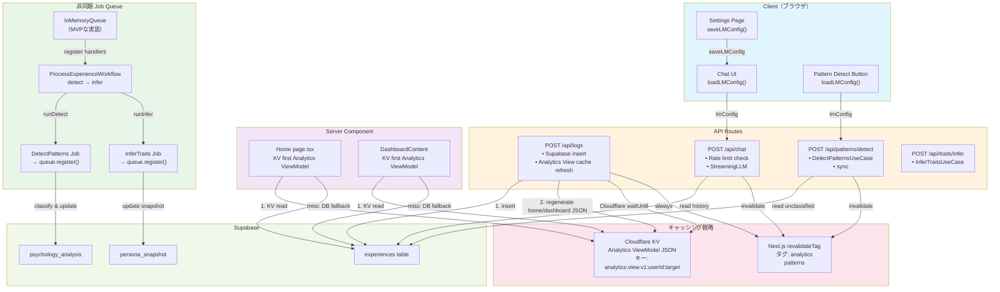
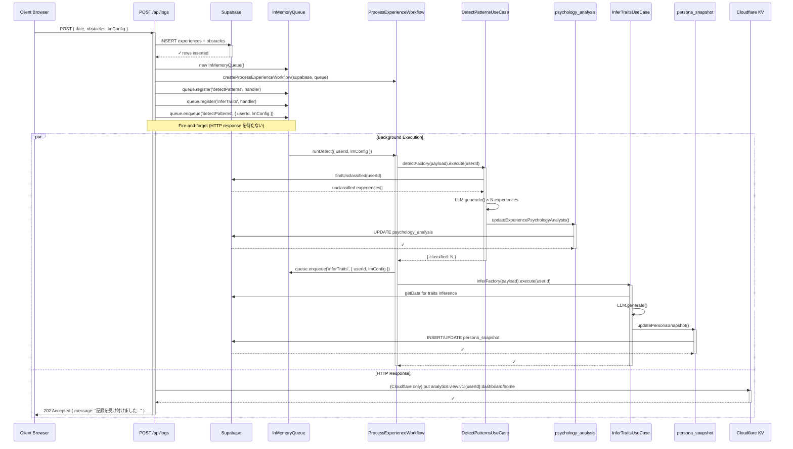

# レンダリングアーキテクチャ

```mermaid
graph TB
    subgraph CLIENT["Client（ブラウザ）"]
        Chat["Chat UI<br/>loadLMConfig()"]
        PatternBtn["Pattern Detect Button<br/>loadLMConfig()"]
        Settings["Settings Page<br/>saveLMConfig()"]
    end

    subgraph SERVER["Server Component"]
        HomePage["Home page.tsx<br/>KV first Analytics ViewModel"]
        Dashboard["DashboardContent<br/>KV first Analytics ViewModel"]
    end

    subgraph API["API Routes"]
        LogAPI["POST /api/logs<br/>• Supabase insert<br/>• Analytics View cache refresh"]
        ChatAPI["POST /api/chat<br/>• Rate limit check<br/>• StreamingLLM"]
        PatternsAPI["POST /api/patterns/detect<br/>• DetectPatternsUseCase<br/>• sync"]
        TraitsAPI["POST /api/traits/infer<br/>• InferTraitsUseCase"]
    end

    subgraph CACHE["キャッシング戦略"]
        KV["Cloudflare KV<br/>Analytics ViewModel JSON<br/>キー: analytics:view:v1:userId:target"]
        ISR["Next.js revalidateTag<br/>タグ: analytics<br/>patterns"]
    end

    subgraph ASYNC["非同期 Job Queue"]
        Queue["InMemoryQueue<br/>（MVPな実装）"]
        Detect["DetectPatterns Job<br/>→ queue.register()"]
        Infer["InferTraits Job<br/>→ queue.register()"]
        Workflow["ProcessExperienceWorkflow<br/>detect → infer"]
    end

    subgraph DB["Supabase"]
        Experiences["experiences table"]
        Psychology["psychology_analysis"]
        Persona["persona_snapshot"]
    end

    Chat -->|"lmConfig"| ChatAPI
    PatternBtn -->|"lmConfig"| PatternsAPI
    Settings -->|"saveLMConfig"| Chat
    HomePage -->|"1. KV read"| KV
    Dashboard -->|"1. KV read"| KV
    HomePage -->|"miss: DB fallback"| Experiences
    Dashboard -->|"miss: DB fallback"| Experiences

    LogAPI -->|"1. insert"| Experiences
    LogAPI -->|"2. regenerate home/dashboard JSON"| KV
    ChatAPI -->|"read history"| Experiences
    PatternsAPI -->|"read unclassified"| Experiences
    
    LogAPI -->|"Cloudflare waitUntil"| KV
    LogAPI -->|"always"| ISR
    ChatAPI -->|"invalidate"| ISR
    PatternsAPI -->|"invalidate"| ISR

    Queue -->|"register handlers"| Workflow
    Workflow -->|"runDetect"| Detect
    Detect -->|"classify & update"| Psychology
    Workflow -->|"runInfer"| Infer
    Infer -->|"update snapshot"| Persona

    style CLIENT fill:#e1f5ff
    style SERVER fill:#f3e5f5
    style API fill:#fff3e0
    style CACHE fill:#fce4ec
    style ASYNC fill:#e8f5e9
    style DB fill:#f1f8e9
```

# 非同期パターン検出/特性推論

```mermaid
sequenceDiagram
    participant Client as Client Browser
    participant LogAPI as POST /api/logs
    participant Supabase as Supabase
    participant Queue as InMemoryQueue
    participant Workflow as ProcessExperienceWorkflow
    participant Detect as DetectPatternsUseCase
    participant Psychology as psychology_analysis
    participant Infer as InferTraitsUseCase
    participant Persona as persona_snapshot
    participant KV as Cloudflare KV

    Client->>LogAPI: POST { date, obstacles, lmConfig }
    activate LogAPI
    
    LogAPI->>Supabase: INSERT experiences + obstacles
    activate Supabase
    Supabase-->>LogAPI: ✓ rows inserted
    deactivate Supabase

    LogAPI->>Queue: new InMemoryQueue()
    LogAPI->>Workflow: createProcessExperienceWorkflow(supabase, queue)
    LogAPI->>Queue: queue.register('detectPatterns', handler)
    LogAPI->>Queue: queue.register('inferTraits', handler)

    LogAPI->>Queue: queue.enqueue('detectPatterns', { userId, lmConfig })
    
    Note over LogAPI,Queue: Fire-and-forget (HTTP response を待たない)
    
    par Background Execution
        Queue->>Workflow: runDetect({ userId, lmConfig })
        activate Workflow
        
        Workflow->>Detect: detectFactory(payload).execute(userId)
        activate Detect
        Detect->>Supabase: findUnclassified(userId)
        Supabase-->>Detect: unclassified experiences[]
        Detect->>Detect: LLM.generate() × N experiences
        Detect->>Psychology: updateExperiencePsychologyAnalysis()
        activate Psychology
        Psychology->>Supabase: UPDATE psychology_analysis
        Supabase-->>Psychology: ✓
        deactivate Psychology
        Detect-->>Workflow: { classified: N }
        deactivate Detect
        
        Workflow->>Queue: queue.enqueue('inferTraits', { userId, lmConfig })
        Workflow->>Infer: inferFactory(payload).execute(userId)
        activate Infer
        Infer->>Supabase: getData for traits inference
        Infer->>Infer: LLM.generate()
        Infer->>Persona: updatePersonaSnapshot()
        activate Persona
        Persona->>Supabase: INSERT/UPDATE persona_snapshot
        Supabase-->>Persona: ✓
        deactivate Persona
        Infer-->>Workflow: ✓
        deactivate Infer
        
        deactivate Workflow
    and HTTP Response
        LogAPI->>KV: (Cloudflare only) put analytics:view:v1:{userId}:dashboard/home
        activate KV
        KV-->>LogAPI: ✓
        deactivate KV
        LogAPI->>Client: 202 Accepted { message: "記録を受け付けました..." }
        deactivate LogAPI
    end
```
